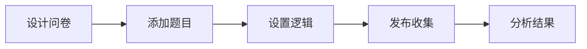

# FormCraft

> 问卷管理平台 · 多题型支持

[](https://vuejs.org/)
[](https://element-plus.org/)
[](LICENSE)
[]()

## 📖 项目简介

FormCraft 是一款功能强大的**在线问卷调查平台**，帮助用户快速创建、分发和分析问卷数据。支持多种题型（单选、多选、富文本等），是现代软件开发方法课程的优秀实践项目。

> 轻松创建专业问卷，高效收集数据 insights

## ✨ 核心功能

### 📝 题型支持

| 题型 | 图标 | 说明 |
|------|------|------|
| 单选题 | 🔘 | 从多个选项中选择一个 |
| 多选题 | ☑️ | 从多个选项中选择多个 |
| 填空题 | 📝 | 文字输入框 |
| 量表题 | ⭐ | N星好评、满意度评分 |
| 富文本 | 🎨 | 支持图片、视频嵌入 |
| 矩阵题 | 📊 | 选项矩阵组合 |
| 排序题 | 🔢 | 对选项进行排序 |

### 🎯 问卷编辑



| 功能 | 说明 |
|------|------|
| 拖拽排序 | 灵活调整题目顺序 |
| 条件逻辑 | 根据上一题答案显示/隐藏题目 |
| 页面分节 | 将问卷分多个页面，减少用户疲劳 |
| 题目复制 | 快速复制已有题目 |

### 📊 数据分析

| 功能 | 说明 |
|------|------|
| 实时统计 | 问卷提交后即时统计 |
| 可视化图表 | 柱状图、饼图、折线图展示结果 |
| 数据导出 | 支持 Excel、CSV 格式导出 |
| 交叉分析 | 多题目关联分析 |

## 🛠️ 技术栈

| 类别 | 技术 |
|------|------|
| 前端框架 | Vue.js |
| UI组件 | Element Plus |
| 状态管理 | Vuex |
| 图表 | ECharts |
| HTTP | Axios |
| 构建工具 | Vite |

## 📁 项目结构

```
FormCraft/
├── public/
├── src/
│   ├── api/
│   │   ├── form.js                # 问卷接口
│   │   ├── question.js             # 题目接口
│   │   └── response.js             # 回答接口
│   ├── components/
│   │   ├── question/               # 题目类型组件
│   │   ├── editor/                 # 编辑器组件
│   │   ├── preview/                # 预览组件
│   │   └── statistic/              # 统计组件
│   ├── views/
│   │   ├── create/                 # 创建问卷
│   │   ├── fill/                   # 填写问卷
│   │   └── result/                 # 结果分析
│   ├── router/
│   ├── store/
│   └── utils/
├── package.json
└── babel.config.js
```

## 🚀 快速开始

### 环境要求

- Node.js 14+
- npm 6+

### 安装依赖

```bash
npm install
```

### 启动开发服务器

```bash
npm run serve
```

### 构建生产版本

```bash
npm run build
```

## 📖 使用流程

1. **选择模板**：空白问卷或预设模板
2. **添加题目**：点击"+添加题目"，选择题型
3. **设置逻辑**：添加条件显示规则
4. **发布问卷**：生成链接和二维码分享
5. **收集数据**：实时查看收集进度
6. **分析结果**：生成可视化报告

## 📊 分析维度

| 维度 | 说明 |
|------|------|
| 基础统计 | 总回复数、完成率、放弃率 |
| 题目分析 | 各选项占比、平均分、分布图 |
| 交叉分析 | 不同题目之间的关联性 |
| 趋势分析 | 随时间变化的收集趋势 |
| 导出报告 | PDF/Excel 格式分析报告 |

## ❓ 常见问题

### Q: 如何设置问卷完成时间限制？

> 在问卷设置中，可以设置答题开始时间和结束时间，也可以设置每份答卷的有效期。

### Q: 支持匿名收集吗？

> 支持！在问卷设置中开启"匿名模式"，收集的数据将不记录用户信息。

### Q: 如何防止刷问卷？

> 系统提供多种防刷机制：IP 限制、设备指纹、验证码、答题时间检测等。

## 📄 License

MIT License
